# IEEE RAS Tunisia Conference (RTC 1.0) - Website 🌐

---

## 📌 Description
Development of the official website for the **IEEE RAS Tunisia Conference (RTC)**.  
The website showcases the event, key information, speakers, the conference program, as well as online registration.  

---

## 🚀 Main Features
- 🏠 **Home Page** with banner and general information  
- 📅 **Conference Program**  
- 👥 **Speakers & Organizers Presentation**  
- 📝 **Registration Form**  
- 📍 **Location & Contact Information**  
- 🌍 **Social Media Integration** (LinkedIn, Instagram, Facebook, etc.)  
- 📷 **Gallery (Photos & Videos)** of the event  

---

## 🛠️ Technologies Used
- **HTML5** – Page structure  
- **CSS3** – Styling & animations  
- **JavaScript (ES6)** – Dynamic interactions  
- **PHP** – Backend processing (forms, registrations, data handling)  

---

## 📸 Screenshots

  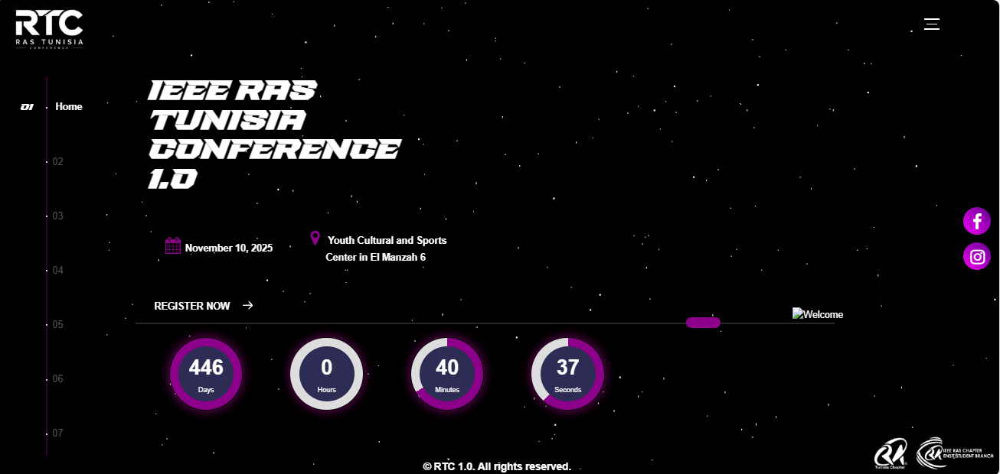 
  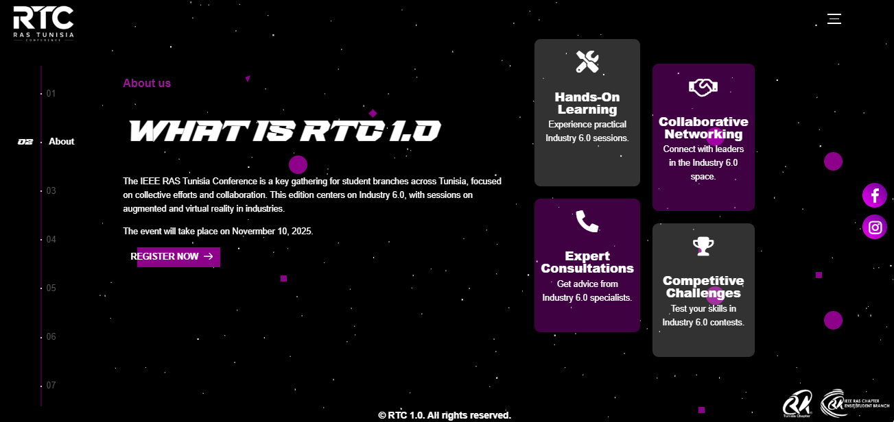 
  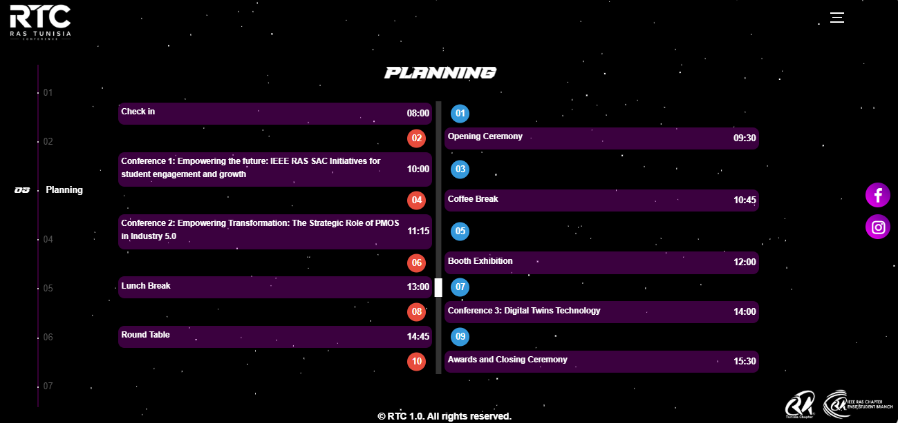 
  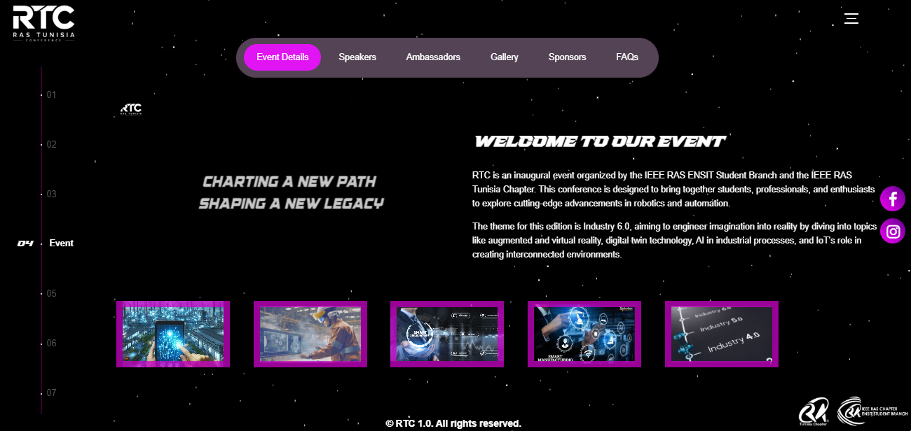 
  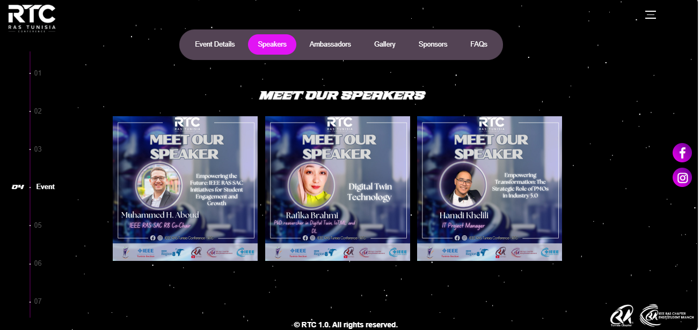 
  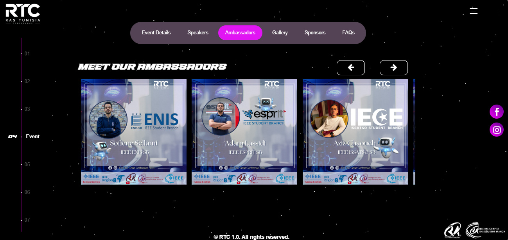 
  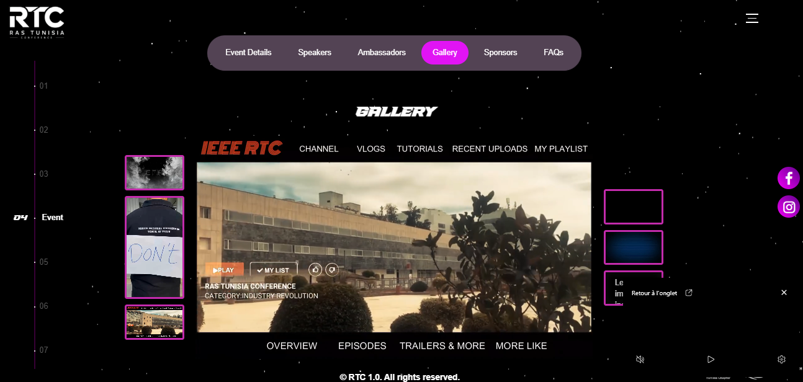 
  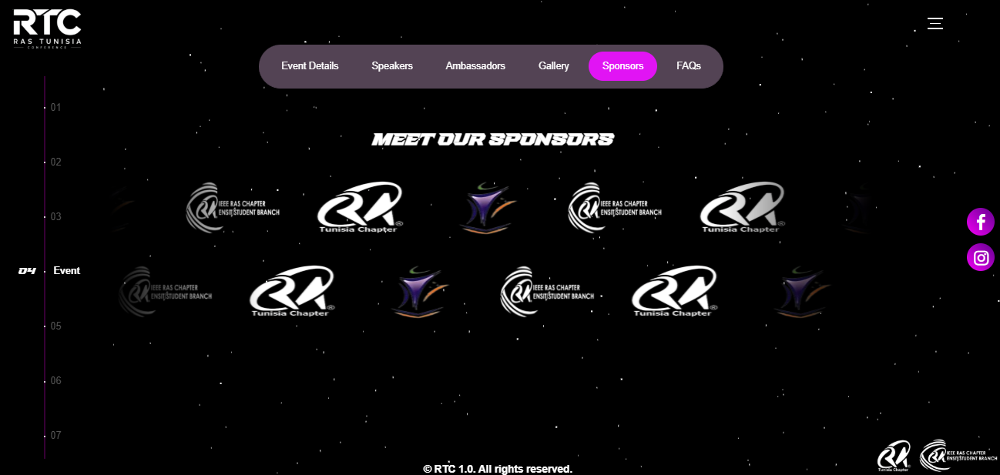 
  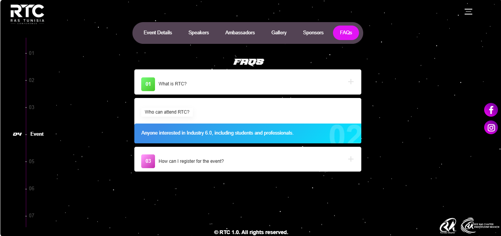 
  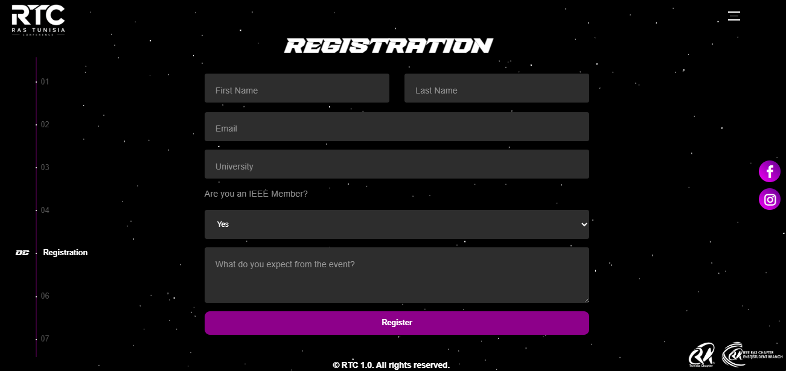 
  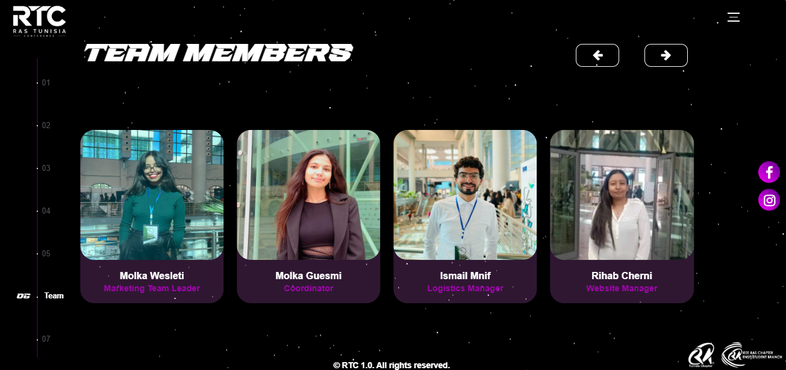 
  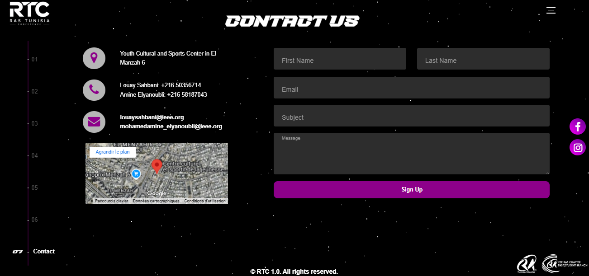 

